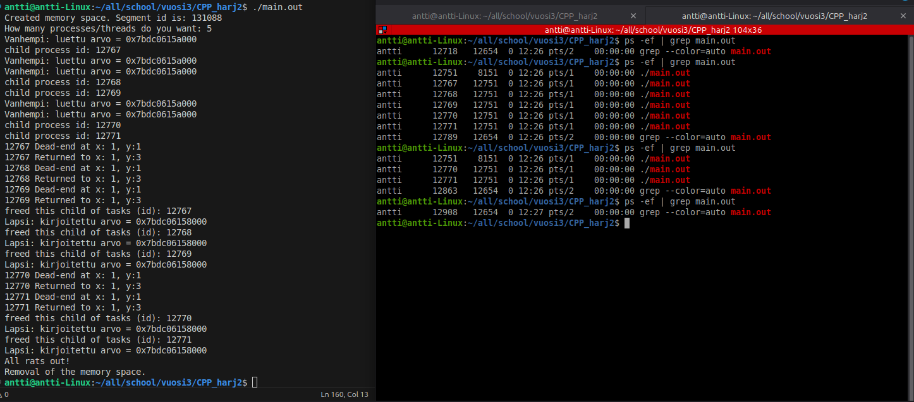

# CPP Harjoitus 2
### Tasks completed:
1
### Total points:
2

#### Task 1

Task 1 done. Processes running side-by-side (limited to three running side-by-side for demonstration purposes). Five child processes are created and three of them are running at the same time while the two other wait. Parent process waits that the "rats" (child processess) have made it trough the labyrinth
