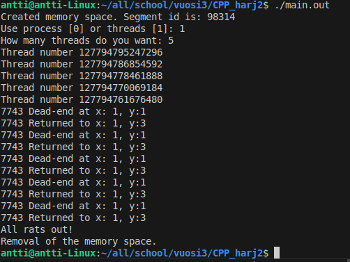

# CPP Harjoitus 2
### Tasks completed:
2
### Total points:
4

#### NOTE

Test are ran in much smaller labyrinth (not int the 100 x 100) and start and goal have been moved to closer of each other.

#### Task 1

Task 1 done. Processes running side-by-side (limited to three running side-by-side for demonstration purposes). Five child processes are created and three of them are running at the same time while the two other wait. Parent process waits that the "rats" (child processess) have made it trough the labyrinth.

#### Task 2

Task 2 done. As we can see from the screenshot five threads are created. Program finishes after we have all rats are out. We can see that all five threads are running on same process (7743).
